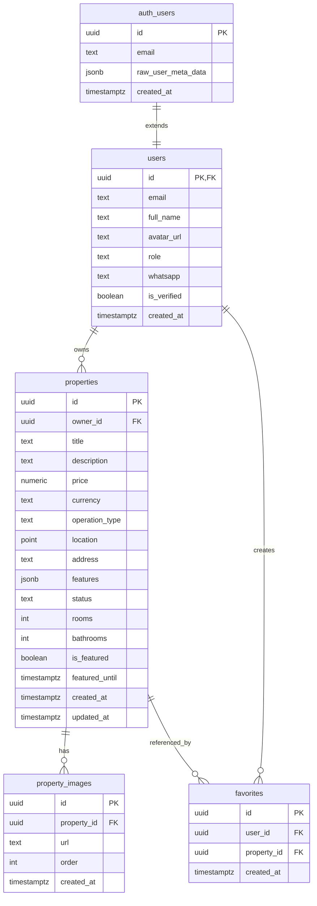
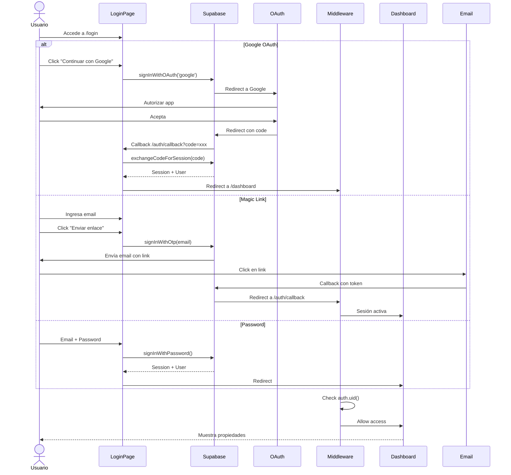
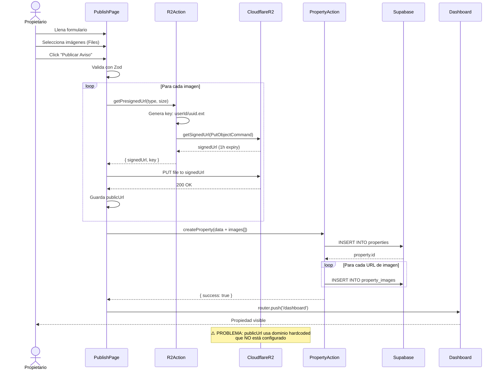
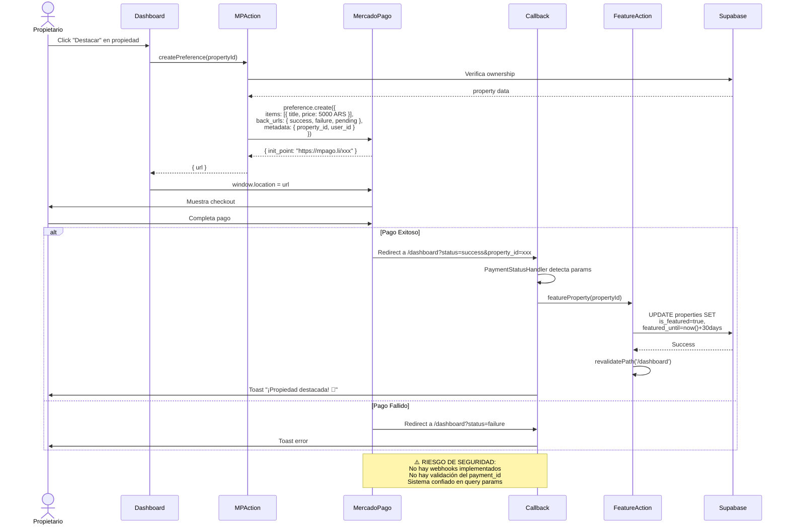
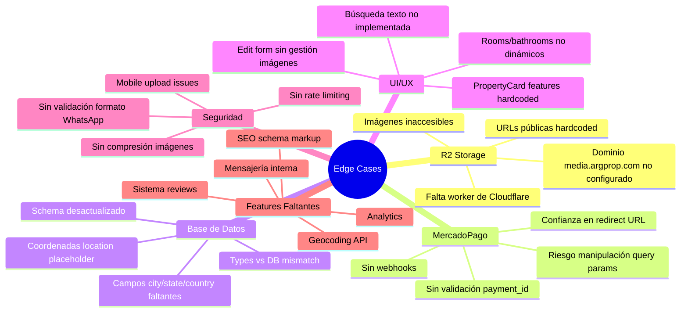

# 🗺️ Diagrama de Flujos - Vacas en la Costa

## 📋 ÍNDICE
1. [Diagrama de Base de Datos](#diagrama-de-base-de-datos)
2. [Flujo de Autenticación](#flujo-de-autenticación)
3. [Flujo de Publicación](#flujo-de-publicación)
4. [Flujo de Pago MercadoPago](#flujo-de-pago-mercadopago)
5. [Arquitectura de Componentes](#arquitectura-de-componentes)

---

## 📊 DIAGRAMA DE BASE DE DATOS



---

## 🔐 FLUJO DE AUTENTICACIÓN



---

## 📤 FLUJO DE PUBLICACIÓN DE PROPIEDAD



---

## 💳 FLUJO DE PAGO MERCADOPAGO (Destacar Propiedad)



---

## 🔄 WORKFLOW USUARIO COMPLETO

```mermaid
flowchart TD
    Start([Usuario visita<br/>vacasenlacosta.com])
    
    Start --> Home[Landing Page]
    
    Home --> |Click Hero CTA| Search{Tipo operación}
    Search --> |Alquiler| SearchRent[/search?op=rent]
    Search --> |Venta| SearchSale[/search?op=sale]
    Search --> |Explorar| SearchAll[/search]
    
    SearchRent --> Filters[Aplica Filtros]
    SearchSale --> Filters
    SearchAll --> Filters
    
    Filters --> ViewMode{Vista}
    ViewMode --> |Lista| CardGrid[Grilla de<br/>PropertyCards]
    ViewMode --> |Mapa| MapView[Mapa con<br/>Markers]
    
    CardGrid --> PropDetail[Detalle Propiedad<br/>/property/[id]]
    MapView --> PropDetail
    
    PropDetail --> AddFav{¿Agregar a<br/>favoritos?}
    AddFav --> |Sí, requiere login| Login[/login]
    AddFav --> |No| Contact
    
    PropDetail --> Contact{¿Contactar?}
    Contact --> |WhatsApp| WA[Abre WhatsApp<br/>con mensaje]
    Contact --> |Compartir| Share[Share Dialog]
    
    Login --> |OAuth/Magic/Pass| AuthFlow[Autenticación]
    AuthFlow --> Dashboard[Dashboard]
    
    Dashboard --> Actions{Acción}
    Actions --> |Nueva| Publish[/publish]
    Actions --> |Editar| Edit[/edit/[id]]
    Actions --> |Destacar| Payment[MercadoPago<br/>Checkout]
    
    Publish --> |Sube imgs + form| CreateProp[createProperty]
    CreateProp --> UploadR2[Upload a R2]
    UploadR2 --> SaveDB[Guarda en DB]
    SaveDB --> Dashboard
    
    Payment --> |Paga| PaymentOK{Pago OK?}
    PaymentOK --> |Sí| Feature[Marca is_featured=true]
    PaymentOK --> |No| Dashboard
    Feature --> Dashboard
    
    style Start fill:#e1f5ff
    style Dashboard fill:#fff4e1
    style PropDetail fill:#ffe1f5
    style Payment fill:#f5e1ff
    style Login fill:#e1ffe1
```

---

## 🏗️ ARQUITECTURA DE COMPONENTES

```mermaid
graph TB
    subgraph "App Router Pages"
        HomePage[page.tsx<br/>Landing]
        SearchPage[search/page.tsx]
        PropertyPage[property/[id]/page.tsx]
        LoginPage[login/page.tsx]
        DashboardPage[dashboard/page.tsx]
        PublishPage[publish/page.tsx]
        ProfilePage[profile/page.tsx]
    end
    
    subgraph "Server Actions"
        PropertyActions[actions/property.ts<br/>createProperty<br/>deleteProperty]
        UploadActions[actions/upload.ts<br/>getPresignedUrl]
        FavoriteActions[actions/favorites.ts<br/>toggleFavorite]
        MPActions[actions/mercadopago.ts<br/>createPreference]
        FeatureActions[actions/feature-property.ts<br/>featureProperty]
        ProfileActions[actions/profile.ts<br/>updateProfile]
    end
    
    subgraph "UI Components"
        Navbar[Navbar]
        PropertyCard[PropertyCard]
        SearchFilters[SearchFilters]
        PropertyMap[PropertyMap]
        LikeButton[LikeButton]
        PaymentHandler[PaymentStatusHandler]
    end
    
    subgraph "Utils & Config"
        SupabaseClient[utils/supabase/client.ts]
        SupabaseServer[utils/supabase/server.ts]
        R2Config[utils/r2.ts]
    end
    
    subgraph "External Services"
        Supabase[(Supabase<br/>PostgreSQL)]
        CloudflareR2[(Cloudflare R2)]
        MercadoPago[MercadoPago API]
        GoogleOAuth[Google OAuth]
    end
    
    HomePage --> Navbar
    SearchPage --> Navbar
    SearchPage --> PropertyCard
    SearchPage --> SearchFilters
    SearchPage --> PropertyMap
    
    PropertyPage --> LikeButton
    PropertyPage --> PropertyMap
    
    DashboardPage --> PaymentHandler
    
    PublishPage --> UploadActions
    PublishPage --> PropertyActions
    
    PropertyActions --> SupabaseServer
    UploadActions --> R2Config
    FavoriteActions --> SupabaseServer
    MPActions --> MercadoPago
    FeatureActions --> SupabaseServer
    
    SupabaseServer --> Supabase
    SupabaseClient --> Supabase
    R2Config --> CloudflareR2
    
    LoginPage --> GoogleOAuth
    
    style Supabase fill:#3ecf8e
    style CloudflareR2 fill:#f6821f
    style MercadoPago fill:#00b1ea
    style GoogleOAuth fill:#4285f4
```

---

## 🔍 MAPA DE EDGE CASES CRÍTICOS



---

## 📝 RESUMEN EJECUTIVO DE GAPS

| Categoría | Problema | Severidad | Bloqueante | Estimación |
|-----------|----------|-----------|------------|------------|
| **Infraestructura** | R2 URLs públicas no configuradas | 🔴 Crítica | ✅ Sí | 4-8h |
| **Pagos** | MercadoPago sin webhooks | 🔴 Crítica | ✅ Sí | 6-10h |
| **Database** | Schema desactualizado | 🟡 Media | ❌ No | 2-4h |
| **UI** | PropertyCard hardcoded | 🟡 Media | ❌ No | 1h |
| **Features** | Geocoding faltante | 🟡 Media | ❌ No | 8-12h |
| **Features** | Búsqueda texto | 🟡 Media | ❌ No | 4-6h |
| **Features** | Edit form incompleto | 🟢 Baja | ❌ No | 6-8h |
| **Seguridad** | Rate limiting | 🟡 Media | ❌ No | 4h |
| **SEO** | Schema markup | 🟢 Baja | ❌ No | 2-3h |

**Total estimado para MVP Production-Ready:** 37-54 horas (~5-7 días)

---

## 🎯 ROADMAP SUGERIDO

### Fase 1: BLOQUEANTES (Semana 1)
- [x] Setup inicial Next.js + Supabase
- [x] Implementar autenticación
- [x] CRUD propiedades básico
- [ ] **🔴 Configurar R2 custom domain/worker**
- [ ] **🔴 Implementar MercadoPago webhooks**
- [ ] Deploy a Vercel staging

### Fase 2: CORE FEATURES (Semana 2)
- [ ] Integrar Geocoding API
- [ ] Implementar búsqueda por texto
- [ ] Completar edit de propiedades
- [ ] Fix PropertyCard dinámico
- [ ] Testing E2E básico
- [ ] Deploy a producción

### Fase 3: MEJORAS (Semana 3-4)
- [ ] Sistema de reviews
- [ ] Rate limiting
- [ ] Analytics
- [ ] SEO avanzado
- [ ] Compresión imágenes
- [ ] Página usuario público

### Fase 4: ESCALABILIDAD (Mes 2+)
- [ ] Mensajería interna
- [ ] Notificaciones push
- [ ] Panel admin
- [ ] Internacionalización
- [ ] App móvil (React Native)

